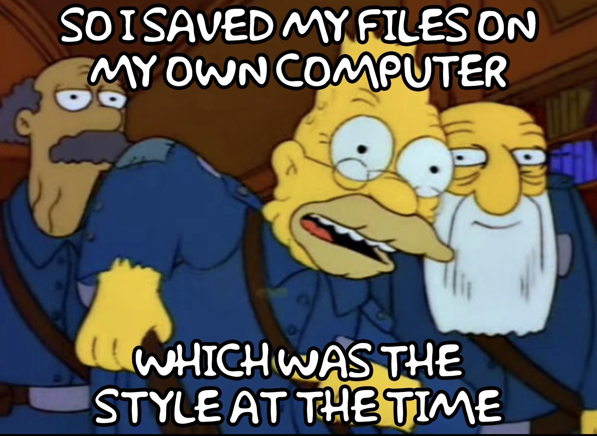

# Saving and Sharing 
{: .no_toc }
Save your collection for use in this web app and exchange files with collaborators.

1. toc
{:toc}

## Save Gallery File

- Save your gallery to your computer by typing a name in the field below “SAVE GALLERY” and click “Save File".

- A file will be saved to your desktop with a name like "coolmaps-gallery.json”. 

- The suffix “-gallery.json” indicates a file that can be read by the Gallery Builder web app. 

## Share via Google Drive

- Access the [shared drive](https://drive.google.com/drive/folders/18hpn5Mntns-cf38rpj5CHfyaTS0BzlXu?usp=sharing){:target="_blank"} for this workshop.

- Upload your gallery file to the drive.

- After others in the workshop have added their files, select one and download it to your computer.

- Open the [Gallery Builder](https://davidrumseymapcenter.github.io/set-builder){:target="_blank"} in a new browser window. 

- Under the heading "LOAD GALLERY" click the Choose File button. Navigate to the file you just downloaded and open it.

## Versioning and Collaboration

- Spend a few minutes modifying the gallery by adding and/or removing items and rearranging things.

- When you are happy with your work, click in the field with the gallery name in it and add your initials to the end of the name. 

- Click Save File.

- Upload your modified gallery to the shared drive.

- Select a modified file -- maybe your own gallery was changed? -- and download it.

- Open the modified file in the gallery builder to view changes.

{: .note-title }
>🔑 About File Naming Conventions
>
> Use a file naming convention (coolmapskl01, coolmapskl02) to keep track of your own versions as well as versions created by collaborators.

## 	Share via email

- Attach your JSON file to an email. Maybe send it to yourself so you can find it later.

- In the body of the email, paste the link to the webapp: <https://davidrumseymapcenter.github.io/set-builder/>{:target="_blank"}

- Tell the recipient to download the file to their desktop and open it using the "Load Gallery" function in the app.

