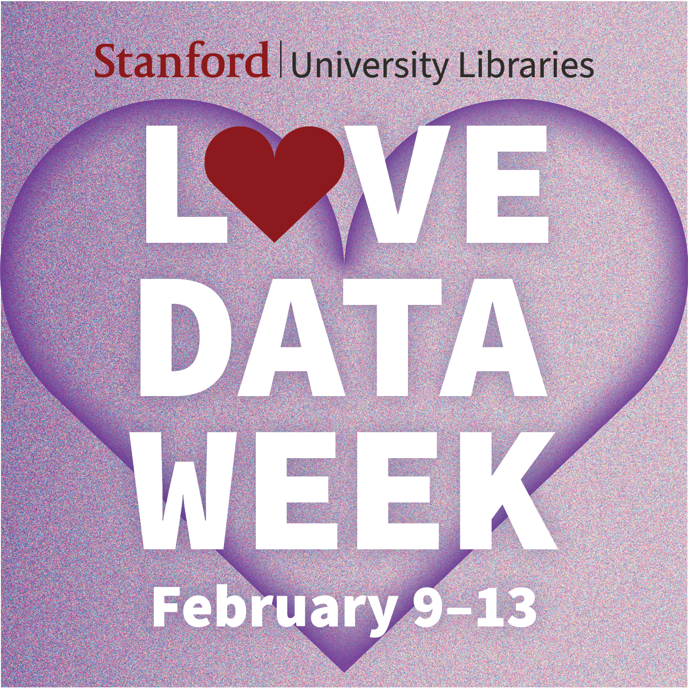

# About

This tutorial covers how to build an image gallery set with the IIIF Gallery Builder web app using images from Searchworks and DavidRumsey.com.

## Objectives

In this workshop participants will create simple, no-code digital galleries of images of maps and other cultural heritage objects for use in research and teaching. Drawing from disparate sources including Stanford's Searchworks catalog, DavidRumsey.com, the Library of Congress website, and the Internet Archive, participants will assemble custom sets of images via their IIIF manifests and a webapp. 

Participants will be familiarized with basic concepts related to IIIF (the International Image Interoperability Framework), learn to locate IIIF manifests for cultural heritage images in online archives, create a first collection, and view examples of ways galleries can be integrated into other resources, including Canvas and GitHub Pages. 
