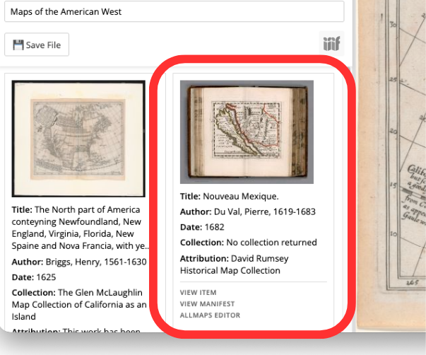
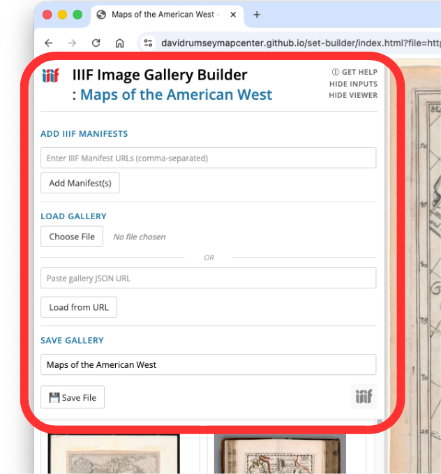
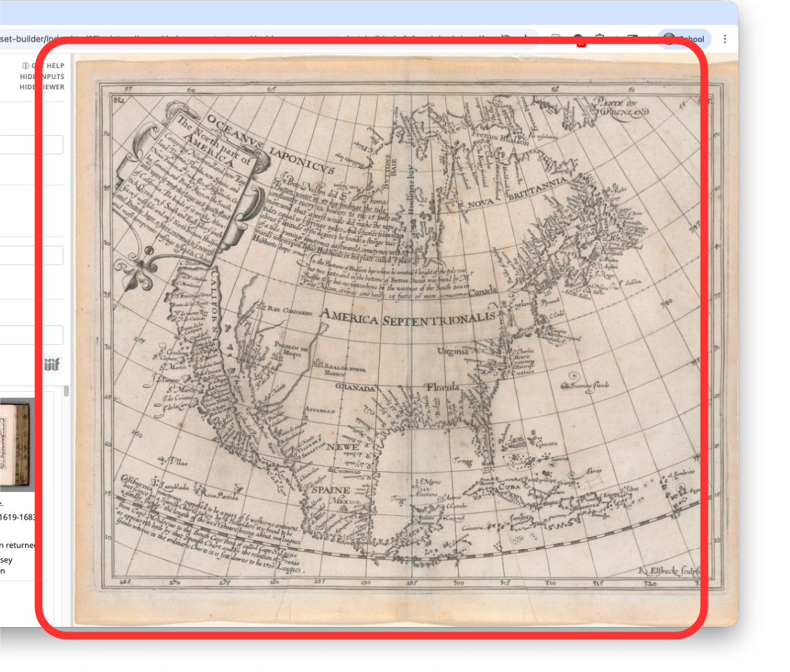

# Understand the Interface

In this section you will familiarize yourself with the different parts of the app. 

## Input Panel

This is the part of the tool where you add images, load existing galleries, and save your work. 

Once saved, the title of your gallery will appear at the top of the window. 

Also at the top there are three control links:
- **GET HELP:** opens the help page
- **HIDE INPUTS:** hides or reveals this input panel
- **HIDE VIEWER:** hides or reveals the zoom panel on the right side of the browser window

### ADD IIIF MANIFESTS

Field for adding manifests, labeled *"Enter IIIF Manifest URLs (comma-separated)"*

### LOAD GALLERY

You can load a previously saved gallery in two ways:
1. Use the Choose File button to upload a file from your computer
2. Paste a link to a file hosted in the cloud in the indicated field and click Load from URL

### SAVE GALLERY

Field to enter title, labelled "Enter gallery name"
Save a gallery in two ways:
1. Save File butto to save locally in a format compatible with this app
2. Export using the IIIF logo in lower right to create a IIIF 2.0 compliant file

## Item Cards

Item cards appear in a grid below the input panel as you add them. 
Each item or page you add to the gallery will have its own card. 

### Image

- **Item thumbnail:** click this to open the image in the viewing pane

### Metadata

- **Title:** note that long titles are truncated after four lines
- **Author:** if source metadata lists multiple creator roles the card will only show the first one
- **Date:** date of publication
- **Collection:** any subgrouping of things the item is part of
- **Attribution:** information about the source institution or information on usage

Note that this is just a summary and metadata handling varies by institution. 
It is a good idea to view the item at its source to see the full metadata record.

### Links

- **VIEW ITEM:** opens the record for the item at its source repository
- **VIEW MANIFEST:** opens the JSON file containing the manifest information in your browser
- **ALLMAPS EDITOR:** opens Allmaps Editor and populates the field with the item manifest 

## Viewing Pane

The viewing pane is on the right side of the gallery window
It provides a window for zooming in and examining item images

- Clicking on the thumbnail image on a card will open the image in the viewing pane
- Zoom in and out with the mouse scroll wheel and click and drag to pan
- Click and drag the vertical bar in the center to resize the viewing pane

