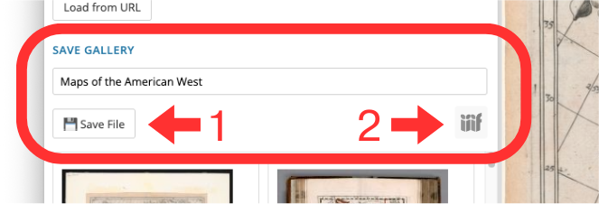

# Saving and Sharing Collections

The Gallery Builder is able to generate two file types.

One kind can be reopened in this webapp, and the other can be ingested by IIIF viewers like [Mirador](https://projectmirador.org/){:target="_blank"} or Universal Viewer. 

THey are both JSON files but have different structures.

In this section we will walk through the differences. 

