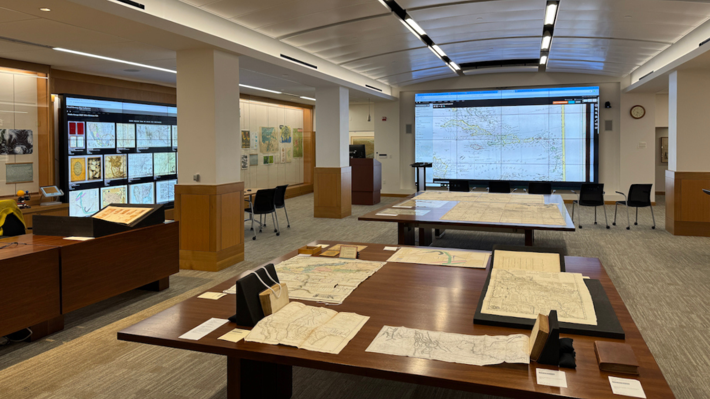
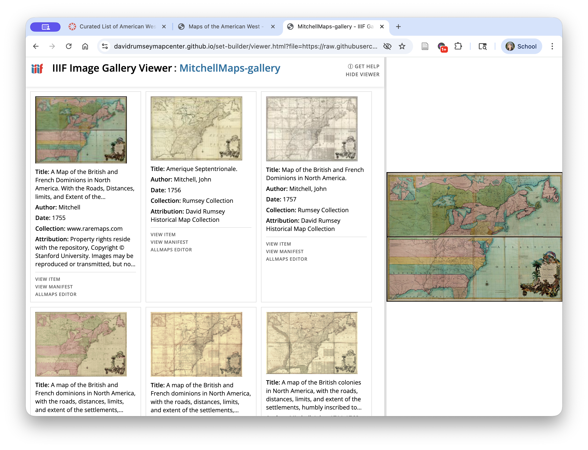
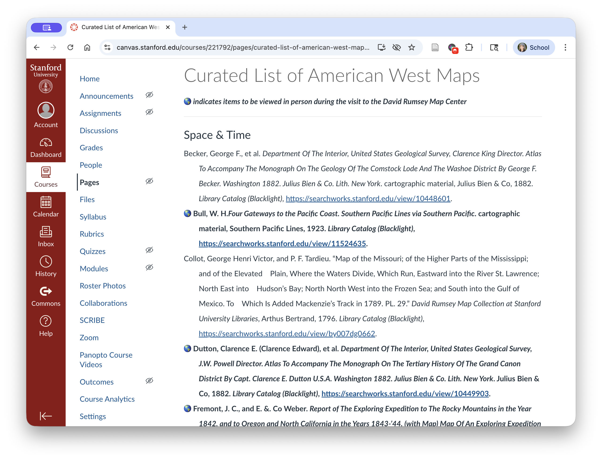
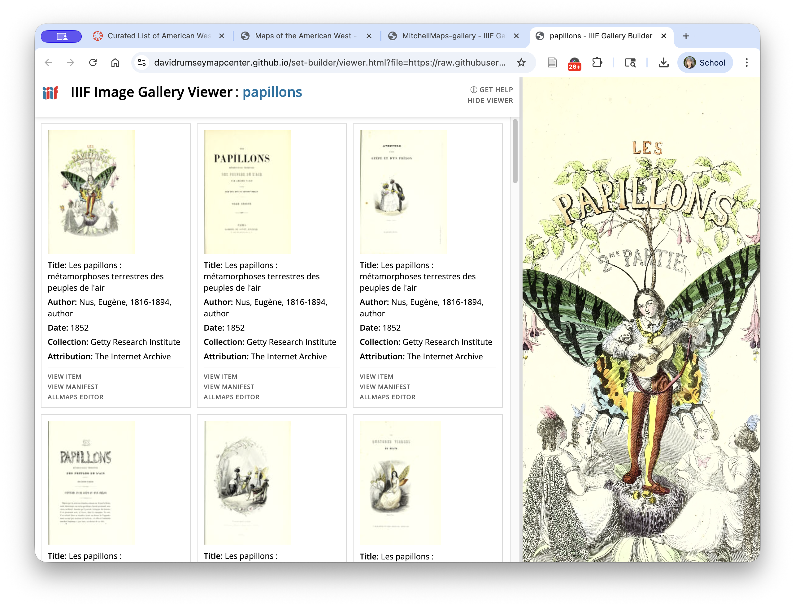

# About the IIIF Gallery Builder
{: .no_toc }

## What's it for?
{: .no_toc }
Here are a few ideas for how Image Galleries can be used. You may find additional use cases.

1. toc
{:toc}

### Working with digital primary source sets

In the David Rumsey Map Center, we use this tool to create and share sets of primary source material (mostly maps) with students and faculty who visit the center with classes. 

It is also part of our internal collaborative process for making the selections that go into those sets.

The Gallery Builder was created for this specific use case. 

### Supporting visual analysis

The gallery builder can be used to create persistant collections of related images from disparate sources. 

In the example below, we have collected versions of the same map from several different institutional repositories. This is helpful for performing visual analysis of a single map in comparison with others, or of all of the maps as a series of related works.

### Visually-enhanced bibliographic management

Management of information sources and citations is an important part of performing research.

Bibliographic management tools like Zotero simplify aggregation of textual sources. While they can be used for citing visual sources as well, it is helpful to be able see the image being referenced while working on a project. This is especially true with items which do not have descriptive titles, or in collections where titles of multiple items are similar.  

The screenshot at left below shows a bibliographic list of maps in a Canvas page. The screenshot at right shows the same collection of maps in an Image Gallery.

 <a href="https://davidrumseymapcenter.github.io/set-builder/viewer.html?file=https://raw.githubusercontent.com/davidrumseymapcenter/set-builder/refs/heads/main/manifests/Maps%20of%20the%20American%20West-gallery.json" target="_blank"> 

### Creating abridged versions of longer texts

The tool can be used to create galleries that show only the pages in a book that contain relevant images. 

#### EXAMPLE
{: .no_toc }

This 1852 book, from the Getty Collection and shared on the Internet Archive: 
- [Les papillons : métamorphoses terrestres des peuples de l'air](https://archive.org/details/lespapillonsmeta02nuse_0/page/n6/mode/thumb){:target="_blank"} by Eugene Nus

Becomes this [gallery of illustrations](https://davidrumseymapcenter.github.io/set-builder/viewer.html?file=https://raw.githubusercontent.com/davidrumseymapcenter/set-builder/refs/heads/main/manifests/papillons.json){:target="_blank"} from that book.

